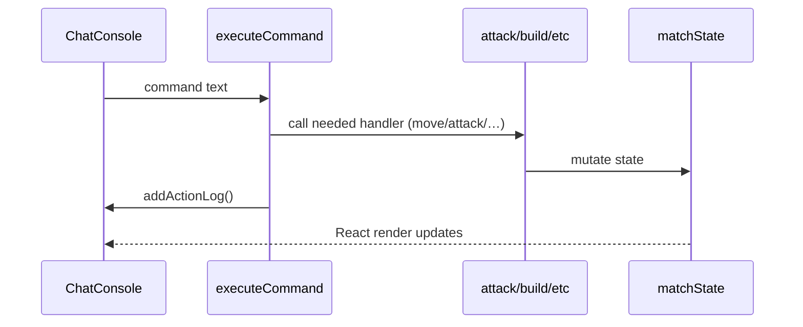

# Saikiong Rodus Architecture

This document reveals the simulator's internals and provides developers with a "map of the terrain" for quick navigation through the codebase.

## Application Layers

1. UI (React)
   * `src/components/*` — all visual components.
     * `ChatConsole.jsx` — central command-input console and action log.
     * `GameInterface.jsx` — main layout ("map + HUD").
     * `Rules.jsx` — viewer for *rules.js* with search and navigation.
   * Styles live in `src/styles/`.
2. Engine (Game Logic)
   * `src/components/scripts/executeCommand.js` — parser and dispatcher for all in-game commands.
   * `attack.js`, `building.js`, `effectsManager.js` and files inside `abilityHandlers/` — low-level services that perform the core logic.
3. Data
   * `maps.js` — 40×28 two-dimensional arrays with tile markup.
   * `abilities.js` — declarative description of all abilities.
   * `data.js` — heroes, items, initial attributes.
4. State (Stores)
   * `mapStore.js` — subscribes to the selected map, stores cell size, etc.
   * `characterStore.js` — dedicated store with a reactive array of characters.
   * `simplifierStore.js` — `id` generator and helper utilities.

## Data Flow on Command Input


## Effect Lifecycle
1. **Creation** — helper from `effects.js` adds an object into `character.effects` and writes a unique `effectId`.
2. **Turn tick** — `effectsManager.js` iterates over each character's effects, calls `effect()` and decrements `turnsRemain`.
3. **Removal** — when `turnsRemain===0`, `consequence()` is invoked and the object is deleted.

## How to Add a New Mechanic
1. Extend `executeCommand.js` (switch by `commandType`).
2. If you need area/beam/teleport — reuse utilities `calculateCellsForZone.js`, `calculateBeamCells.js`, `calculateTeleportationCells.js`.
3. For items add passives/actives in `itemEffects.js` and register them in the `buy` section.
4. New abilities — declaration in `abilities.js` + handler inside `abilityHandlers/`.

## Extension Points
| Module | Purpose | How to extend |
|--------|---------|---------------|
| `effects.js` | basic status-effects | add a creator function and export it |
| `itemEffects.js` | active/passive items | implement two functions `applyXPassive` / `useXActive` |
| `abilityHandlers/` | complex abilities | add a file + export it in `index.js` |
| `maps.js` | new maps | copy the template, preserving the 40×28 size |

## Testing
Critical calculations (damage/armor) are isolated into standalone functions, which simplifies unit testing. Vitest is recommended:
```bash
npm i -D vitest
```

---
*Last update*: {{DATE}} 